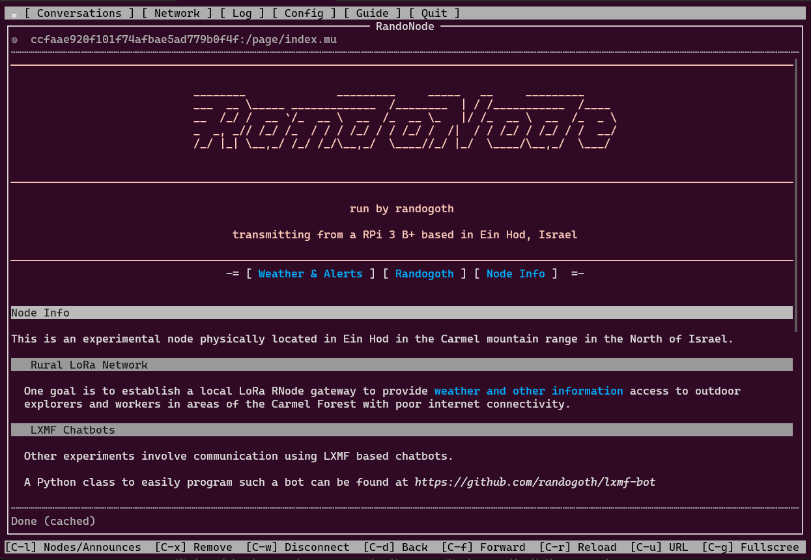

Repository moved to [codeberg.org/randogoth/micron-blog.git](https://codeberg.org/randogoth/micron-blog.git)

# micron-blog

Pelican Plug-In and Theme for publishing a site in Micron markup format for [Nomad Network](https://github.com/markqvist/NomadNet/) Nodes

## Example

The *RandoNode* pages at `<ccfaae920f101f74afbae5ad779b0f4f>` are generated using this Plug-In.



## Installation

Install dependencies

```
$ pip3 install -r requirements.txt
```

## Create a Static Site from Scratch

Use the `example` folder as a starting point...

+ Write your content in markdown formatted files and place them in the `content` folder
+ Edit the micron formatted Jinja2 templates in `theme/templates` to your liking
+ Generate the blog by running the following command in the `example` folder:

```
$ pelican content
```

## Use alongside an existing Pelican installation

+ Copy the theme and plugin to your Pelican site's folder
+ Duplicate your `pelicanconf.py` file to something like `micronconf.py`
+ Edit the new file and make sure Pelican can find the new folders by adding them to the `PLUGIN_PATHS` and editing the `THEME` and `PLUGINS` variables respectively
+ If you want to place the micron .mu files in a different output folder than your generated HTML files, specify a path in a variable called `MICRON_PATH`
+ Make sure `RELATIVE_URLS` is set to `True`
+ Make sure all Links in your Markdown articles and pages are relative and local, since you will not be able to access http links inside Nomad Network

Example Settings, vary depending on your setup:

```Python
PLUGIN_PATHS = ["pelican-plugins"]
PLUGINS = ['micron']
THEME = 'micron-theme'
MICRON_PATH = 'micron_out'
RELATIVE_URLS = True
```

Generate the Micron pages by pointing Pelican to the Micron config file:

```
$ pelican content -s micronconf.py
```

## Deployment

If you have not run Nomad Network yet, initialize the needed folder by running `nomadnet` once

```
$ nomadnet
```

Copy the generated .mu files from the output folder to the NN node's `pages` folder:
```
$ cp -R output/* ~/.nomadnetwork/storage/pages
```

Run your node and serve the pages....

## Additional Formatting

Since micron templates do not support styling like CSS and Markdown is a strict content-only markup language all the color styling needs to be done using micron tags in the template files themselves. 

Micron-blog offers a few Settings that allow to set enclosing tags for some of the inline and block elements that are rendered by Pelican:

```Python
MICRON_EMPHASIS_FORMAT = []
MICRON_STRONG_FORMAT = []
MICRON_LINK_FORMAT = []
MICRON_CODE_FORMAT = []
MICRON_HEADER_FORMAT = []
MICRON_QUOTE_FORMAT = []
MICRON_LIST_FORMAT = []
```

Each of them taks a list of exactly two tag definitions, one for the left and one for the right enclosing tag. For example, if you want to define all rendered links to be blue and underlined and all emphasized text to be yellow you could define the following settings in `pelicanconfig.py`:

```Python
MICRON_LINK_FORMAT = ['`F00f`_', '`_`f']
MICRON_EMPHASIS_FORMAT = ['`Fff0', '`f']
```

Now links created as:
```Markdown
[title](url)
*emphasized text*
```
will be rendered as:
```
`F00f`_`[title`url]`_`f
`Fff0`*emphasized text`*`f
```

If you want the same settings to be honoured by the templates, they need to be implemented respecively. The settings are accessible by the templates:
```jinja
{{ MICRON_LINK_FORMAT[0] }}`[{{ p.title }}`:/page/{{ p.url }}]{{ MICRON_LINK_FORMAT[1] }}
```

## Dynamic Content

If you want to place an executable script file in the output folder, use Pelican's `STATIC_PATHS`
setting to mark it as a static file and the `EXTRA_PATH_METADATA` setting to copy it to
the output folder.

```python
STATIC_PATHS = ['../scripts/helloworld.mu']
EXTRA_PATH_METADATA = {'../scripts/helloworld.mu': {'path': 'micron/helloworld.mu'},}
```

A good way to link to such a dynamic content file is to add a dummy article or page with an
empty `save_as` meta tag and a `url` tag pointing to the script's final location.
```
Title: Hello World
Date: 2023-05-22
save_as: 
url: helloworld.mu
```
(see the `pelicanconf.py `and `script.md` files in the examples folder.)